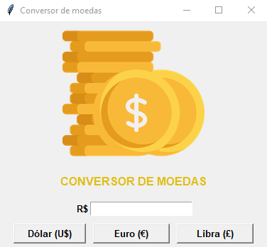

# ConversorMoedas-PythonAPI
Mini projeto em Python, um conversor de moedas (R$), desenvolvido em Python com uma interface visual do tkinter com ligação com uma API que traz as taxas das moedas atualizadas diariamente.

- API utilizada: https://docs.awesomeapi.com.br/api-de-moedas

 
   

